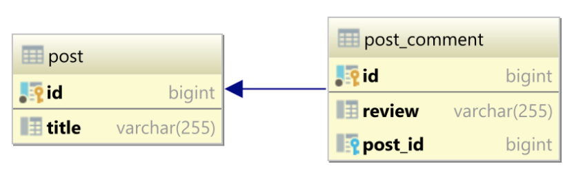

# A Spring Data JPA app

This project demonstrates best practices related to the following topics:
* Eager vs Lazy relations - the classic [N Plus One](src/test/java/com/att/training/spring/boot/demo/nplusone/NPlusOneTest.java) problem

* [Using JPA projections](src/test/java/com/att/training/spring/boot/demo/projections/ProjectionTest.java)
* [Hibernate 2nd level cache](src/test/java/com/att/training/spring/boot/demo/cache/L2CacheTest.java) with Hazelcast (an embedded distributed cache provider) 
* Spring Data JPA [DELETE methods](src/test/java/com/att/training/spring/boot/demo/bulk/MultipleStatementVsBulkDeleteTest.java)
  * Without Hibernate batching
  * With Hibernate batching **enabled**
  

  